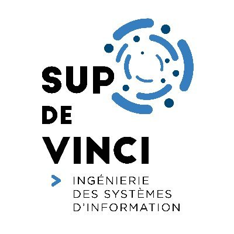
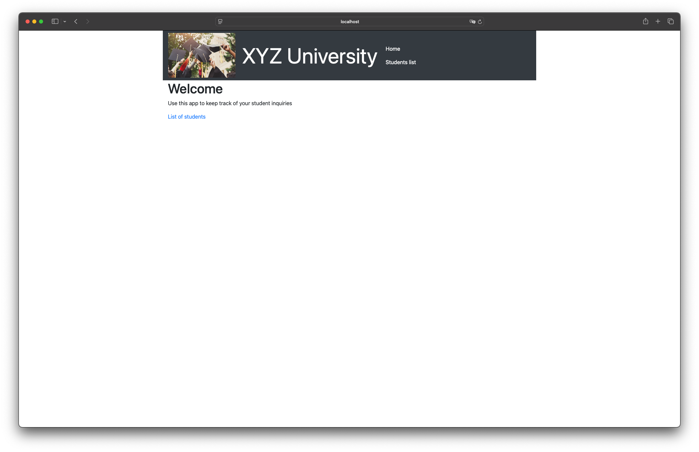

# Créer une application web hautement disponible et pouvant être mise à l'échelle avec Terraform

*Auteurs*: [Matteo ZINUTTI](https://www.linkedin.com/in/matteozinutti/) / [Fabien CHEVALIER](https://www.linkedin.com/in/fabche/)

> [!IMPORTANT]
> Ce projet est réalisé dans le cadre de la formation [Master 2 Spécialisation DevOps, Infrastructure et Cloud](https://www.supdevinci.fr/formations/mastere-specialisation-devops/) à l'école SupDeVinci. Le sujet est disponible [ici](https://ready-player-school.notion.site/Projet-Cr-er-une-application-web-hautement-disponible-et-pouvant-tre-mise-l-chelle-avec-Terrafo-1b1f3a8bf3b6811caa40fd61f0f9a642). La durée de réalisation était de 4 jours.

- [Créer une application web hautement disponible et pouvant être mise à l'échelle avec Terraform](#créer-une-application-web-hautement-disponible-et-pouvant-être-mise-à-léchelle-avec-terraform)
  - [Scénario](#scénario)
  - [Organisation du projet](#organisation-du-projet)
  - [License](#license)

## Scénario

L'Université Exemple se prépare à la nouvelle année scolaire. Le service des admissions a reçu des plaintes selon lesquelles son application web pour les dossiers des étudiants est lente ou n'est pas disponible pendant la période de pointe des admissions en raison du nombre élevé de demandes de renseignements.

Vous êtes un ingénieur cloud. Votre responsable vous a demandé de créer une preuve de concept (POC) pour héberger l'application web dans le Cloud AWS. Votre responsable souhaite que vous conceviez et mettiez en œuvre une nouvelle architecture d'hébergement qui améliorera l'expérience des utilisateurs de l'application web. Vous êtes chargé de mettre en place l'infrastructure permettant d'héberger l'application web des dossiers des étudiants dans le cloud.

Votre défi consiste à planifier, concevoir, construire et déployer l'application web sur le Cloud AWS d'une manière conforme aux bonnes pratiques du cadre AWS Well-Architected Framework. Lors des pics d'admission, l'application doit prendre en charge des milliers d'utilisateurs, pouvoir être mise à l'échelle et être hautement disponible, à charge équilibrée, sécurisée et performante.

## Organisation du projet

Le rendu de se projet est documenté par parties, documentées dans les fichiers `README` disponibles dans chaque dossiers : 

- [Phase 1 : Création d'une application web fonctionnelle de base](./phase1/README.md)
- [Phase 2 : Découplage des composants de l'application](./phase2/README.md)
- [Phase 3 : Mise en œuvre de la haute disponibilité et de la capacité de mise à l'échelle élevée](./phase3/README.md)
- [Phase 4 : Packaging de l'application](./phase4/README.md)

> [!WARNING]
> La phase 5 a été annulée par le formateur pour des raisons de faisabilité technique dans un environnement de formation.

- [Phase 6-7 :  Mise en place d’une pipeline CI/CD - Ajout d’un orchestrateur de conteneurs](./phase6-7/README.md)
- [Phase 8 : Amélioration et Optimisation](./phase8/README.md)

## License

This project is licensed under the Apache License 2.0 - see the [LICENSE](LICENSE.md) file for details.