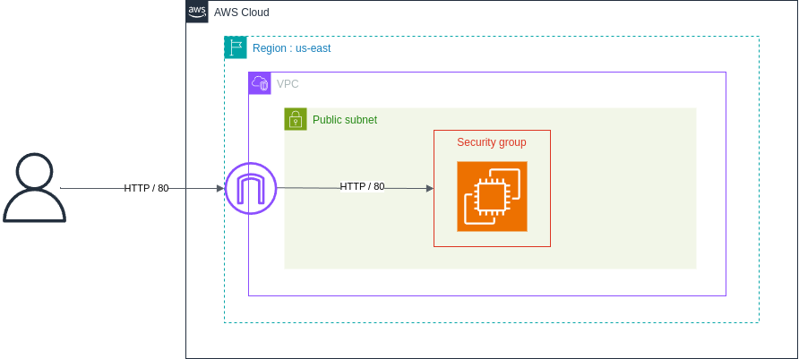
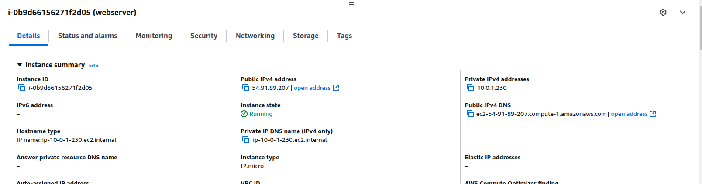
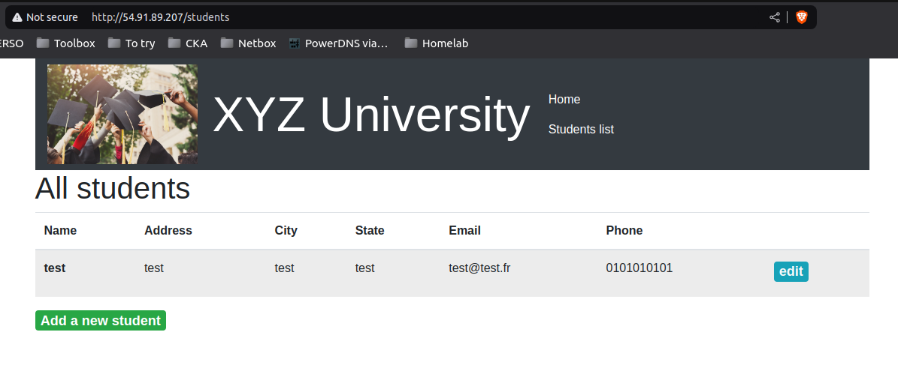

# Phase 1 : Création d'une application web fonctionnelle de base

## Architecture du repo

```plaintext
.
├── main.tf #Configuration du provider AWS
├── networks.tf #Configuration VPC, subnet, route table et IGW
├── providers.tf #Déclaration des providers nécessaires
├── security_group.tf #Configuration du security group web
├── variables.tf #Variable terraform
└── virtual_machine.tf #Configuration de l'instance EC2
```

## Déploiement de l'infrastucture

1. Ajout des credentials AWS nécessaires au provider dans le fichier `main.tf`
2. `terraform init`
3. `terraform plan`
4. `terraform apply`

## Schéma d'architecture



## Configuration

1. Déploiement d'un VPC avec un subnet public, route table, internet gateway
2. Création d'un security groups permettant l'accès HTTP/HTTPS (80/443)
3. Création instance ec2 avec user-data pour lancer le webserver
4. Association de l'instance ec2 avec le security group 

## Capture réalisation phase 1

- Instance EC2 qui fait office de serveur web avec notre application JS



- Accès au site web via l'IP publique sur le port 80 avec la possibilité de réalisé des actions comme création, modification et suppresion d'un user via la base de données en local sur l'instance EC2.

