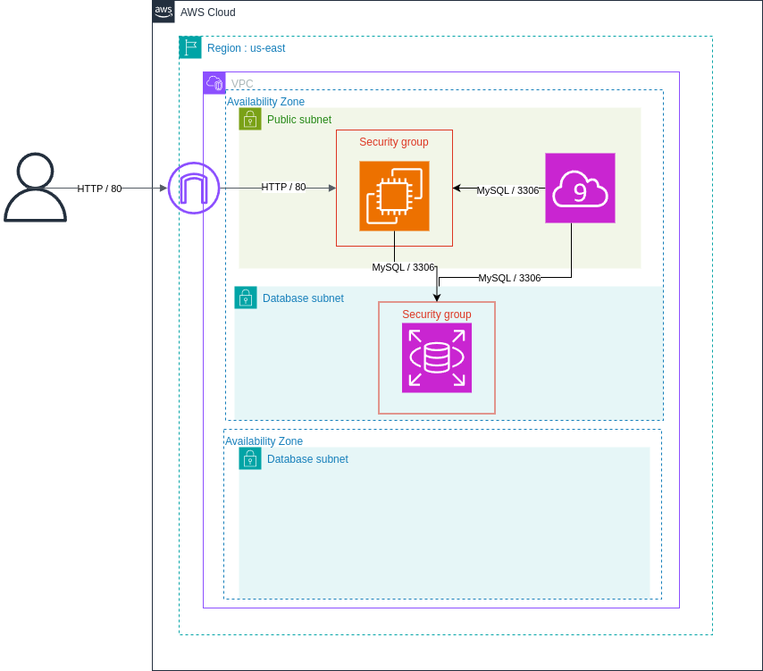

# Phase 2 : Découplage des composants de l'application

## Architecture du repo

```plaintext
.
├── cloud9.tf #Configuration instance cloud9
├── database.tf #Configuration RDS
├── data.tf #Déclaration data terraform
├── main.tf #Configuration du provider AWS
├── networks.tf #Configuration VPC, subnet, route table et IGW
├── outputs.tf #Déclaration output terraform
├── providers.tf #Déclaration des providers nécessaires
├── security_group.tf #Configuration des security group
├── variables.tf #Variable terraform
└── virtual_machine.tf #Configuration des instances EC2
```

## Déploiement de l'infrastucture

1. Ajout des credentials AWS nécessaires au provider dans le fichier `main.tf`
2. `terraform init`
3. `terraform plan`
4. `terraform apply`

## Schéma d'architecture



## Configuration

1. Déploiement de la phase 1
2. Déploiement des databases subnets
3. Création de la base RDS
4. Création de l'instance Cloud9
5. Depuis l'instance cloud9 (CLI)
   1. Création du secret dans AWS Secret manager
   2. Dump de la BDD de l'instance phase 1
   3. Envoie du dump de la BDD dans la base RDS

## Capture réalisation phase 2

- Déploiement de la nouvelle instance EC2 et du l'instance cloud9


- Le serveur web de la phase 1 toujours en fonctionnement


- Depuis cloud9, création du secret dans AWS secret manager


- Depuis le terminal, dump de la DB de l'instance de la phase 1


- Import de la DB dump dans la base de données RDS


- Vérification des données dans la base RDS


- Le serveur web connecter à la base de données RDS fonctionnement, et la manipulation des users également (création, modification, suppression)

