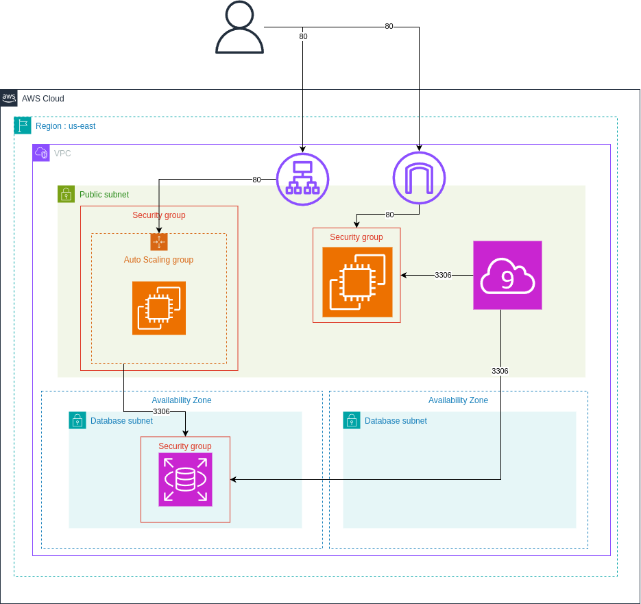
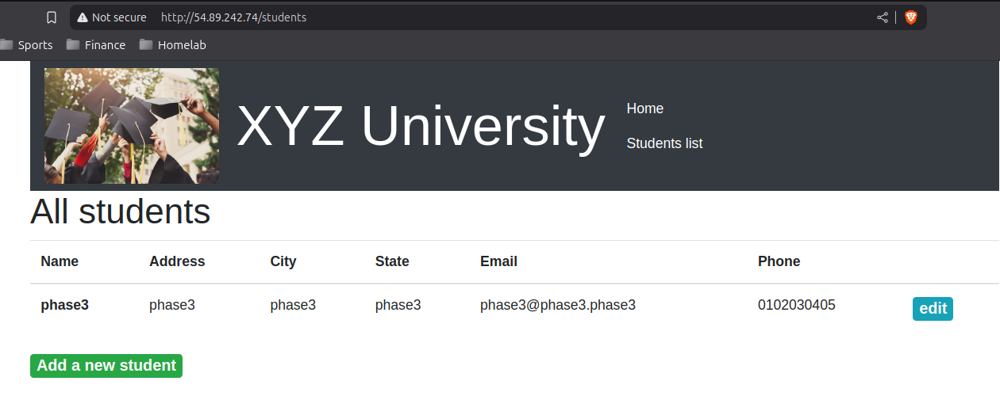
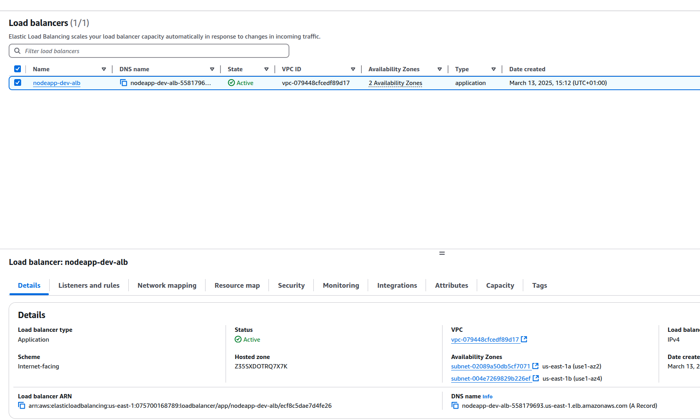
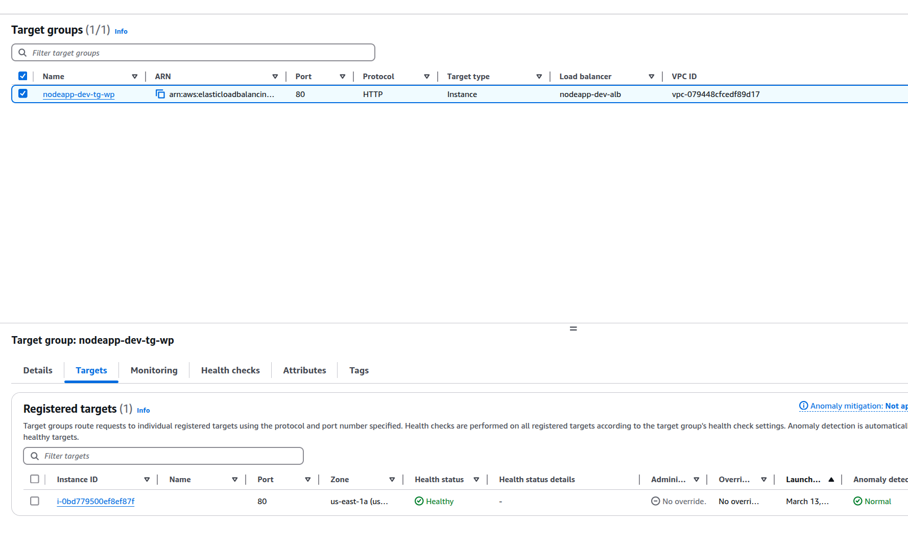
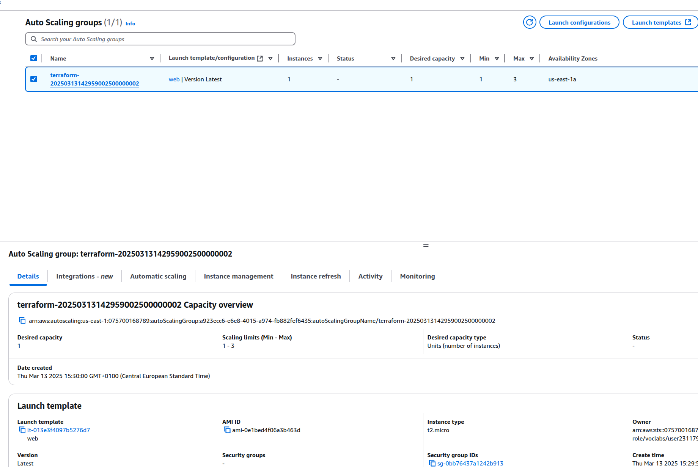
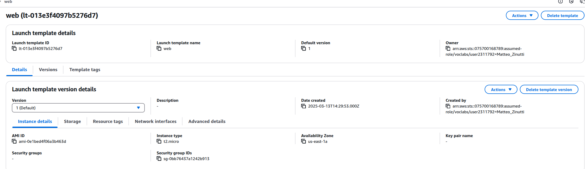
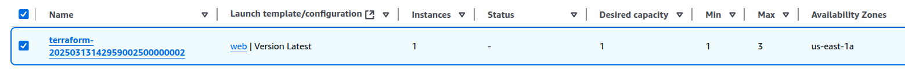
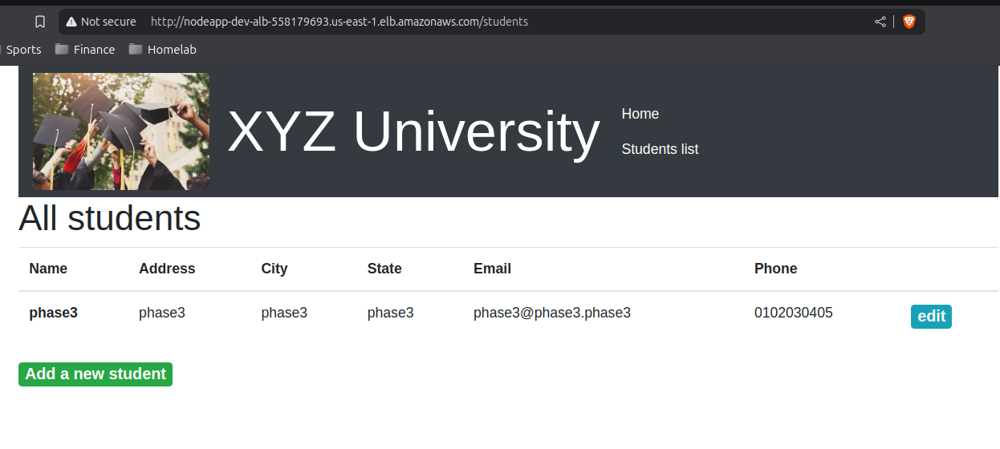
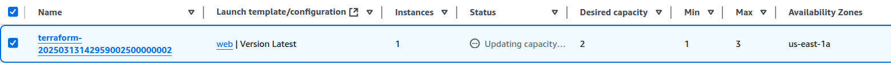
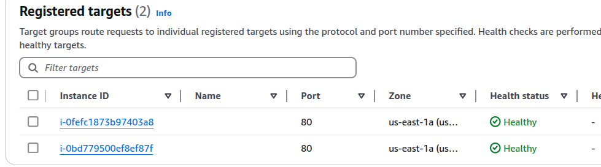

# Phase 3 : Mise en œuvre de la haute disponibilité et de la capacité de mise à l'échelle élevée

## Architecture du repo

```plaintext
.
├── alb.tf #loadbalancer + targetgroup
├── asg.tf #scaling group + launch template
├── cloud9.tf #instance cloud9
├── database.tf #RDS
├── data.tf #data terraform
├── ec2.tf #instance ec2
├── keypair.tf #clé publique
├── providers.tf #providers nécessaires
├── main.tf #provider AWS
├── networks.tf #VPC, subnet, route table et IGW
├── outputs.tf #output terraform
└── user-data-p3.sh #Script webserver phase3
```

## Déploiement de l'infrastucture

1. Ajout des credentials AWS nécessaires au provider dans le fichier `main.tf`
2. `terraform init`
3. `terraform plan`
4. `terraform apply`

## Schéma d'architecture



## Configuration

1. Déploiement de la phase 2
2. Déploiement du ALB
3. Déploiement du launch template
4. Déploiement du ASG
5. Ajout des target pour ALB depuis ASG
6. Test de scaling

## Capture réalisation phase 2

- Webserver phase1



- Application loadbalancer



- Target group ALB



- Configuration ASG



- Launch template pour ASG



- ASG réglé sur 1 instance



- Webserver depuis ALB



- Scale ASG à 2 instances



- Target group après scale à 2 instances

