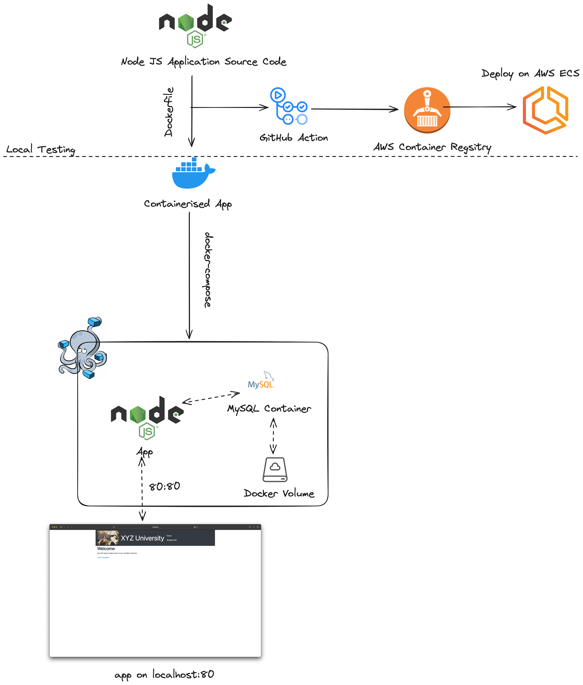
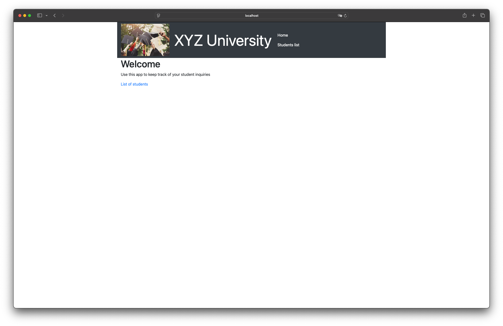

# Packaging de l'application

## Objectif

L’objectif est de préparer l’application pour être facilement déployable.

- Créer un **Dockerfile** pour conteneuriser l’application.
- Stocker l’image sur **Amazon Elastic Container Registry (ECR)** ou une autre regitry.
- Tester l’exécution du package localement et sur une instance EC2.

## Sommaire

- [Packaging de l'application](#packaging-de-lapplication)
  - [Objectif](#objectif)
  - [Sommaire](#sommaire)
  - [Schéma représentatif](#schéma-représentatif)
  - [Réalisation](#réalisation)
    - [Dockerfile](#dockerfile)
      - [Modifications apportées au code source](#modifications-apportées-au-code-source)
        - [Variables d'environnement](#variables-denvironnement)
        - [Initialisation de la base de donnée](#initialisation-de-la-base-de-donnée)
    - [ECR et déploiement](#ecr-et-déploiement)
    - [Test de l'application](#test-de-lapplication)

## Schéma représentatif



## Réalisation

### Dockerfile

Pour Dockeriser l'application, j'ai récupéré le code source de l'application fournie dans le projet via le [lien fourni](https://aws-tc-largeobjects.s3.us-west-2.amazonaws.com/CUR-TF-200-ACCAP1-1-91571/1-lab-capstone-project-1/s3/UserdataScript-phase-2.sh) et intégré ce code dans le répertoire `resources/` du dossier. Le `Dockerfile` créé est le suivant : 

```Dockerfile
FROM node:16
WORKDIR /app

# Install system dependencies
RUN apt-get update && apt-get install -y unzip

# Copy application code
COPY resources/codebase_partner/package*.json ./
RUN npm install
COPY resources/codebase_partner/ .

EXPOSE 80
CMD ["npm", "start"]
```

#### Modifications apportées au code source

##### Variables d'environnement

Dans une logique de déploiement CloudNative, il m'as fallu modifier le code source applicatif afin de le rendre indempotant. De base, l'application utilisais le SDK d'AWS pour récupérer les données de connection avec une condition de récupération des données de connection si elles n'étaient pas déjà présentes. Dans le cas ou la récupération via AWS SDK échouaient, les données de connection étaient `hardcodées` dans le code source.

La première modification fut de passer par des variables d'environnement afin de simplifier le workflow de connection : 

```javascript
// resources/app/config/config.js
// config.js
// Load environment variables from .env file for local development
require('dotenv').config();

// Define configuration with environment variables and fallbacks
const config = {
  APP_DB_HOST: process.env.APP_DB_HOST || "",
  APP_DB_USER: process.env.APP_DB_USER || "",
  APP_DB_PASSWORD: process.env.APP_DB_PASSWORD || "",
  APP_DB_NAME: process.env.APP_DB_NAME || "",
  APP_PORT: process.env.APP_PORT || 80,
};

// Log notice for any config using default values
Object.keys(config).forEach(key => {
  if (!process.env[key]) {
    console.log(`[NOTICE] Value for key '${key}' not found in ENV, using default value. See app/config/config.js`);
  }
});

module.exports = config;
```

Cette modification permet de passer les variables d'environnement lors de l'exécution du conteneur Docker, et permet de tester l'application via `docker-compose` en local via l'ajout d'un fichier `.env` à la racine du projet.

##### Initialisation de la base de donnée

L'initialisation de la base de donnée se faisais auparavant via un script shell, j'ai donc modifié le code source pour qu'il initialise la base de donnée lors du démarrage de l'application. Le but étant in-fine d'avoir une méthode de déploiement unique et indempotant, en local comme sur ECS via l'utilisation de bases de données managées (RDS). Ainsi, au démarrage de l'application, si la base de donnée n'existe pas, elle est créée et les tables sont initialisées via un script SQL fourni :

```sql
USE students;

-- Create table only if it doesn't exist
CREATE TABLE IF NOT EXISTS students (
    id INT NOT NULL AUTO_INCREMENT,
    name VARCHAR(255) NOT NULL,
    address VARCHAR(255) NOT NULL,
    city VARCHAR(255) NOT NULL,
    state VARCHAR(255) NOT NULL,
    email VARCHAR(255) NOT NULL,
    phone VARCHAR(100) NOT NULL,
    PRIMARY KEY (id)
);
```

> [!NOTE]
> J'ai du modifier la logique de connection à la base en prenant en compte les limitations imposées par AWS RDS. En effet, RDS ne permet pas de créer de users avec des droits d'administration sur la base de donnée. Dans le cas de ce POC, j'utilise donc l'user root pour la connection à la base de donnée. C'est bien sûr à éviter en production.

### ECR et déploiement

Cette étape est dépendante de la phase 6 et 7 du projet pour les raisons suivantes :

- La phase 6 consiste en la mise en place d'une pipeline CI/CD. *J'ai intégré cette étape dès maintenant via un workflow GitHub Actions*. 

```yaml
# .github/workflows/build-and-push.yml
name: Build and Push to ECR

on:
  push:
    branches:
      - main
    paths:
      - 'phase4/resources/**'
  workflow_dispatch:

env:
  ECR_REPOSITORY: example-university-ecr
  AWS_REGION: us-east-1

jobs:
  build-and-push:
    runs-on: ubuntu-latest

    steps:
      - name: Checkout code
        uses: actions/checkout@v4

      - name: Configure AWS Credentials
        uses: aws-actions/configure-aws-credentials@v4
        with:
          aws-access-key-id: ${{ secrets.AWS_ACCESS_KEY_ID }} # unsecure, for POC purposes
          aws-secret-access-key: ${{ secrets.AWS_SECRET_ACCESS_KEY }} # unsecure, for POC purposes
          aws-region: ${{ env.AWS_REGION }}

        
      - name: Login to Amazon ECR
        id: ecr-login
        uses: aws-actions/amazon-ecr-login@v2

      - name: Set up Docker Buildx
        uses: docker/setup-buildx-action@v3

      - name: Build and push
        uses: docker/build-push-action@v6
        with:
          context: phase4/
          push: true
          tags: ${{ steps.ecr-login.outputs.registry }}/${{ env.ECR_REPOSITORY }}:${{ github.sha }},${{ steps.ecr-login.outputs.registry }}/${{ env.ECR_REPOSITORY }}:latest
      
      - name: Update ECS Service
        run: |
          aws ecs update-service --cluster example-university-prod-ecs --service example-university-prod-app --force-new-deployment --region ${{ env.AWS_REGION }}
```

- La phase 7 consiste en la mise en place d'une infrastructure Cloud (ECS) pour déployer l'application. *Ayant terraformé l'ensemble, ECR est donc aussi déployé via Terraform*.

> [!NOTE]
> Le packaging de l'application fais partie du process de déploiement permettant d'héberger l'application sur ECS. Il est donc nécessaire de réaliser les phases en amont 6 et 7 afin de pouvoir tester le déploiement de l'application.

### Test de l'application

Le but final du projet étant de déployer l'application sur une solution d'orchestrateur de containers, j'ai fais le parti pris de tester l'application en local via `docker-compose` et non sur EC2. La raison étant que l'architecture sous-jacente permettant de déployer l'application sur EC2 est différente de celle permettant de déployer sur ECS. Ainsi, le test de l'application sur EC2 n'aurait pas été pertinent pour le projet.

Le `docker-compose.yml` créé est le suivant :

```yaml
services:
  app:
    build: .
    ports:
      - "80:80"
    depends_on:
      - db
    networks:
      - app-network

  db:
    image: mysql:8.0
    environment:
      MYSQL_ROOT_PASSWORD: password
      MYSQL_DATABASE: students
    command: --default-authentication-plugin=mysql_native_password
    volumes:
      - mysql-data:/var/lib/mysql
    ports:
      - "3306:3306"
    networks:
      - app-network

volumes:
  mysql-data:

networks:
  app-network:
    driver: bridge
```

Pour tester la solution, il faut fournir un fichier `.env` à la racine du projet. Cette étape est facilitée par la présence d'un `.env.example` fourni qu'il suffit de renommer :

```bash
cp ./resources/codebase_partner/.env.example ./resources/codebase_partner/.env
```
Puis :

```bash
docker-compose up
```

> [!NOTE]
> J'ai ajouté un process de `retry` lors de l'init de la base de donnée MySQL. En effet, le temps de démarrage de la base de donnée étant plus long que celui de l'application, il est nécessaire d'attendre que la base de donnée soit prête avant de lancer l'application. 

L'application est accessible via [http://localhost](http://localhost).

