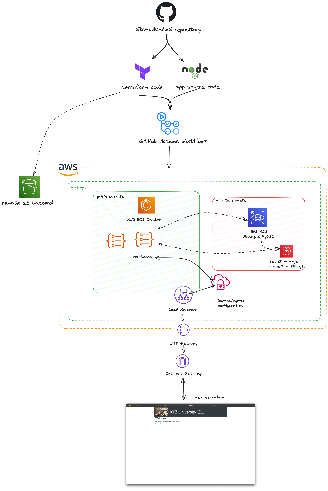
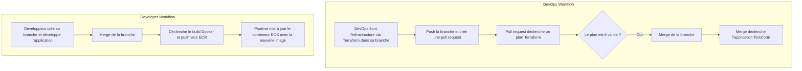
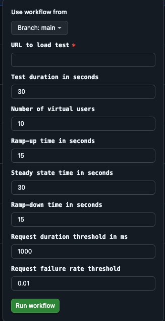
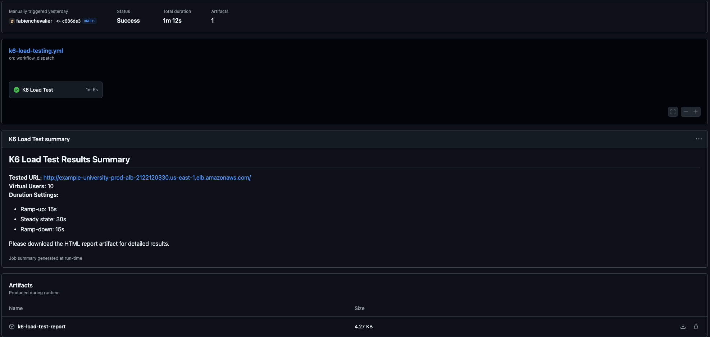

# Mise en place d’une pipeline CI/CD / Ajout d’un orchestrateur de conteneurs

## Objectifs

L’objectif est d’automatiser le déploiement.

- Configurer un **GitLab CI/CD**, **GitHub Actions** ou **AWS CodePipeline**.
- Définir les étapes :
  - Build de l’application.
  - Packaging et push de l’image Docker.
  - Test de charge.

L’objectif est de passer à un déploiement avec un orchestrateur.

- Déployer l’application sur **Amazon ECS** (EC2) , **Amazon EKS** (Kubernetes) ou utiliser un autre orchestrateur.

## Sommaire

- [Mise en place d’une pipeline CI/CD / Ajout d’un orchestrateur de conteneurs](#mise-en-place-dune-pipeline-cicd--ajout-dun-orchestrateur-de-conteneurs)
  - [Objectifs](#objectifs)
  - [Sommaire](#sommaire)
  - [Schéma représentatif](#schéma-représentatif)
  - [Réalisation](#réalisation)
    - [Pipeline CI/CD](#pipeline-cicd)
      - [GitFlow](#gitflow)
      - [Packaging et push de l'image Docker](#packaging-et-push-de-limage-docker)
      - [Test de charge](#test-de-charge)
    - [Déploiement sur Amazon ECS](#déploiement-sur-amazon-ecs)
      - [Auto-Scaling et Load Balancing](#auto-scaling-et-load-balancing)

## Schéma représentatif



## Réalisation

### Pipeline CI/CD

#### GitFlow



La représentation schématique ci-dessus détaille le GitFlow mis en place via les fichiers présents dans le répertoire `./.github/workflows/`.

Le choix à été porté vers l'utilisation d'actions managées par GitHub, afin de simplifier la gestion des workflows.

> [!NOTE]
> Par manque de temps/ressources, le GitFlow proposé ne propose pas de checks/tests unitaires permettant de valider le code source avant de le déployer.

#### Packaging et push de l'image Docker

Comme expliqué en partie 4, l'ensemble du packaging est effectué via le workflow `build-and-push.ml`. Ce dernier est déclenché si des modifications ont été effectuées sur le répertoire `./resources/` situé dans le dossier partie 4.

#### Test de charge

Le choix à été fait de proposer un test de charge semi-automatique. En effet, il est nécessaire de récupérer le DNS public de l'Application Load Balancer afin de pouvoir effectuer le test.

Ce test utilise l'outil `k6` et est déclenché via le workflow `k6-load-testing.yml`, manuellement par l'utilisateur : 



Les résultats du tests sont ensuite disponibles dans les logs de GitHub Actions, et téléchargeables :



Un fichier HTML est également généré, permettant de visualiser les résultats du test de charge. Un example est disponible en [cliquant ici](./assets/summary.html).

### Déploiement sur Amazon ECS

L'ensemble de l'architecture est déployée via Terraform. L'architecture du dossier `terraform` est la suivante : 

```plaintext
├── alb.tf
├── ecr.tf
├── ecs.tf
├── iam.tf
├── outputs.tf
├── provider.tf
├── rds.tf
├── task-definitions.tf
├── variables.tf
└── vpc.tf
```

Chaque fichier correspond à une configuration AWS spécifique. L'ensemble permet de : 

- Créer un VPC
- Créer un cluster ECS
- Créer un Application Load Balancer
- Créer le repository ECR
- Créer les rôles IAM nécessaires
- Créer les tâches ECS hébergeant l'application
- Créer une base de données RDS
- Configurer toute la partie réseau et sécurité

Cette configuration est en suite déployée via GitHub Action.

> [!NOTE]
> Le backend Terraform utilisé passe par un bucket S3 créé manuellement en amont.

#### Auto-Scaling et Load Balancing

Pour rester hautement disponible et resister à la charge, ce POC inclut une règle d'autoscaling basée sur la charge CPU des instances ECS : 

```terraform
resource "aws_appautoscaling_target" "dev_to_target" {
  max_capacity       = 1
  min_capacity       = 1
  resource_id        = "service/${aws_ecs_cluster.ecs-cluster.name}/${aws_ecs_service.app-service.name}"
  scalable_dimension = "ecs:service:DesiredCount"
  service_namespace  = "ecs"
}

resource "aws_appautoscaling_policy" "dev_to_cpu" {
  name               = "dev-to-cpu"
  policy_type        = "TargetTrackingScaling"
  resource_id        = aws_appautoscaling_target.dev_to_target.resource_id
  scalable_dimension = aws_appautoscaling_target.dev_to_target.scalable_dimension
  service_namespace  = aws_appautoscaling_target.dev_to_target.service_namespace

  target_tracking_scaling_policy_configuration {
    predefined_metric_specification {
      predefined_metric_type = "ECSServiceAverageCPUUtilization"
    }

    target_value = 60
  }
}
```
