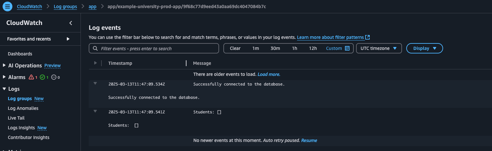

#  Amélioration et Optimisation

## Objectifs

Dans cette dernière phase, vous devez être **force de proposition** pour améliorer votre solution en allant au-delà des exigences initiales. L’objectif est de **réfléchir aux points d'amélioration possibles** et d'implémenter au moins une optimisation technique pertinente.

**Exemples d'améliorations possibles (liste non exhaustive) :**

- Mise en place d'une **authentification** pour sécuriser l'application.
- Ajout d'une **surveillance et d'une analyse des logs** avec **CloudWatch** ou **ELK Stack**.
- Passage à une **architecture serverless** (ex : Lambda + API Gateway).

## Sommaire

- [Amélioration et Optimisation](#amélioration-et-optimisation)
  - [Objectifs](#objectifs)
  - [Sommaire](#sommaire)
  - [Réalisation](#réalisation)
    - [Analyse des logs avec CloudWatch](#analyse-des-logs-avec-cloudwatch)

## Réalisation

### Analyse des logs avec CloudWatch

Profitant de l'aspect "managé" d'ECS, la mise en place de l'aggrégation des logs avec CloudWatch est une tâche relativement simple. Dans le fichier `task-definitions.tf` permettant de construire les tâches hébergeant les containers, la configuration suivante à été ajoutée : 

```json
logConfiguration = {
        logDriver = "awslogs",
        options = {
          awslogs-group         = "app",
          awslogs-region        = "us-east-1",
          awslogs-create-group  = "true",
          awslogs-stream-prefix = "app"
        }
}
```

Il suffit ensuite d'autoriser les containers à écrire dans CloudWatch via la configuration des rôles IAM : 

```terraform

resource "aws_iam_policy" "cloudwatch_logs_policy" {
  name        = "${var.project}-${var.env}-CloudWatchLogsPolicy"
  description = "Policy to allow ECS tasks to create and write to CloudWatch log groups"
  policy      = jsonencode({
    Version = "2012-10-17"
    Statement = [
      {
        Effect   = "Allow"
        Action   = [
          "logs:CreateLogGroup",
          "logs:CreateLogStream",
          "logs:PutLogEvents"
        ]
        Resource = "arn:aws:logs:*:*:*"
      }
    ]
  })
}

resource "aws_iam_policy_attachment" "cloudwatch_logs_policy_attachment" {
  name       = "${var.project}-${var.env}-AttachCloudWatchLogsPolicy"
  roles      = [aws_iam_role.ecs_task_execution_role.name]
  policy_arn = aws_iam_policy.cloudwatch_logs_policy.arn
}
```

Les logs sont ensuite disponibles dans CloudWatch, et peuvent être analysés via les métriques et les filtres disponibles. 


